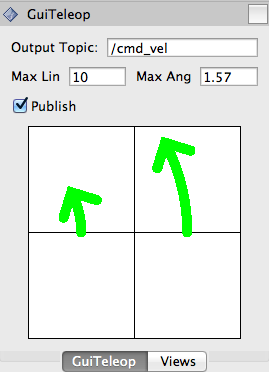

GUI Teleop - Rviz Panel
==========

GUI-Based Robot Teleop - Differential Drive. This plugin is a customized version of the Rviz [teleop tutorial](http://docs.ros.org/indigo/api/rviz_plugin_tutorials/html/panel_plugin_tutorial.html).

<p align="center">
    
</p>

## Dependencies & Prerequisites
[ROS Hydro](http://wiki.ros.org/hydro), [Gazebo 3.0+](http://gazebosim.org/), [Catkin](http://wiki.ros.org/catkin): see [package.xml](package.xml)

[Rviz](http://wiki.ros.org/rviz), [Qt4](http://qt-project.org/) (or higher)

## Installation
Clone and catkin_make
```bash
$ git clone https://github.com/MohitShridhar/gui_teleop
$ cd <catkin_ws>
$ catkin_make --pkg gui_teleop
```

## Usage

Once you have compiled the package, select "Add New Panel" in the Panel menu bar (Rviz). You should be able to spot 'GuiTeleop' in the list. For more details see the [original tutorial](http://docs.ros.org/indigo/api/rviz_plugin_tutorials/html/panel_plugin_tutorial.html)